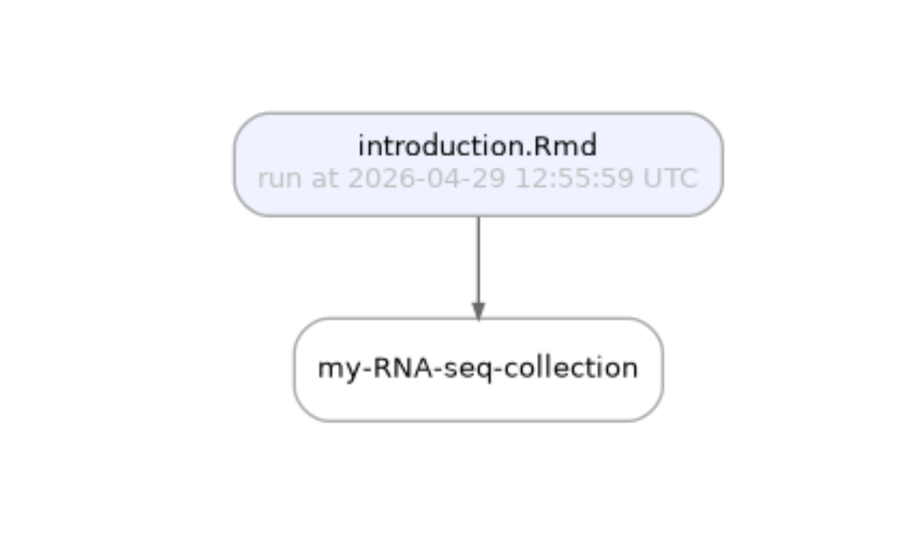

# Introduction

This vignette introduces the **{laminr}** workflow but reproducing
examples from the LaminDB documentation.

To learn more about LaminDB, see [docs.lamin.ai](https://docs.lamin.ai).

## Introduction

### Setup

Install the **{laminr}** package.

``` r
install.packages("laminr", dependencies = TRUE)
```

Create a LaminDB instance:

    lc <- laminr::import_module("lamin_cli")
    lc$init(storage = "./mydata", modules = c("bionty"))

Or if you have write access to an instance, login and connect to it:

    lc$login()
    lc$connect("<account>/<instance>")

### Quickstart

In an R session, transfer an scRNA-seq dataset from the
`laminlabs/cellxgene` instance, compute marker genes with **{Seurat}**,
and save results.

``` r
ln <- laminr::import_module("lamindb")  # instantiate the central object of the API

# Access inputs -------------------------------------------

ln$track()
cellxgene_artifacts <- ln$Artifact$connect("laminlabs/cellxgene")
artifact <- cellxgene_artifacts$get("7dVluLROpalzEh8m")
adata <- artifact$load()

# Your transformation -------------------------------------

library(Seurat)
seurat_obj <- CreateSeuratObject(counts = as(Matrix::t(adata$X), "CsparseMatrix"), meta.data = adata$obs)
seurat_obj[["RNA"]] <- AddMetaData(GetAssay(seurat_obj), adata$var)
Idents(seurat_obj) <- "cell_type"
seurat_obj <- NormalizeData(seurat_obj)
markers <- FindAllMarkers(seurat_obj, features = Features(seurat_obj)[1:100])
seurat_path <- tempfile(fileext = ".rds")
saveRDS(seurat_obj, seurat_path)

# Save outputs --------------------------------------------

ln$Artifact(seurat_path, key = "my-datasets/my-seurat-object.rds")$save()
ln$Artifact$from_df(markers, key = "my-datasets/my-markers.parquet")$save()
ln$finish()
```

If you did not use RStudio’s notebook mode, create an html export and
then run the following.

``` r
lc$save("my-analyis.Rmd")  # save source code and html report for a `.qmd` or `.Rmd` file
```

## Tutorial

See <https://docs.lamin.ai/tutorial>

### Track notebooks & scripts

See <https://docs.lamin.ai/tutorial#track-notebooks-scripts>

``` r
library("laminr")
ln <- import_module("lamindb")
#> → connected lamindb: testuser1/laminr-intro-20251215133222
ln$track()
#> → created Transform('WxpGfvePUK5X0000', key='introduction.Rmd'), started new Run('J5t4lTQDMNIVHenH') at 2025-12-15 13:32:41 UTC
#> • recommendation: to identify the notebook across renames, pass the uid: ln$track("WxpGfvePUK5X")

ln$Transform$to_dataframe()
#>                uid              key description     type source_code hash
#> 1 WxpGfvePUK5X0000 introduction.Rmd        <NA> notebook        <NA> <NA>
#>   reference reference_type config is_flow version is_latest is_locked
#> 1      <NA>           <NA>   <NA>   FALSE    <NA>      TRUE     FALSE
#>            created_at branch_id space_id flow_id environment_id created_by_id
#> 1 2025-12-15 13:32:41         1        1    <NA>           <NA>             2
#>   _template_id
#> 1         <NA>
ln$Run$to_dataframe()
#>                uid name          started_at finished_at params reference
#> 1 J5t4lTQDMNIVHenH <NA> 2025-12-15 13:32:41        <NA>   <NA>      <NA>
#>   reference_type is_locked          created_at branch_id space_id transform_id
#> 1           <NA>     FALSE 2025-12-15 13:32:41         1        1            1
#>   report_id _logfile_id environment_id created_by_id initiated_by_run_id
#> 1      <NA>        <NA>           <NA>             2                <NA>
```

### Manage artifacts

See <https://docs.lamin.ai/tutorial#manage-artifacts>

#### Create an artifact

See <https://docs.lamin.ai/tutorial#create-an-artifact>

``` r
df <- ln$core$datasets$small_dataset1(otype = "DataFrame", with_typo = TRUE)
df
#>         ENSG00000153563 ENSG00000010610 ENSG00000170458 perturbation
#> sample1               1               3               5         DMSO
#> sample2               2               4               6         IFNJ
#> sample3               3               5               7         DMSO
#>         sample_note             cell_type_by_expert cell_type_by_model
#> sample1      was ok                          B cell             B cell
#> sample2  looks naah CD8-positive, alpha-beta T cell             T cell
#> sample3  pretty! 🤩 CD8-positive, alpha-beta T cell             T cell
#>           assay_oid concentration treatment_time_h donor
#> sample1 EFO:0008913          0.1%               24 D0001
#> sample2 EFO:0008913        200 nM               24 D0002
#> sample3 EFO:0008913          0.1%                6  <NA>
#>                      donor_ethnicity
#> sample1 Chinese, Singaporean Chinese
#> sample2         Chinese, Han Chinese
#> sample3                      Chinese

artifact <- ln$Artifact$from_dataframe(df, key = "my_datasets/rnaseq1.parquet")$save()  # create and save
#> → writing the in-memory object into cache
artifact$describe()  # describe
#> Artifact: my_datasets/rnaseq1.parquet (0000)
#> ├── uid: gm7W92MPzQZe4sfM0000            run: J5t4lTQ (introduction.Rmd)
#> │   kind: dataset                        otype: DataFrame               
#> │   hash: XCilWuw2o1cOHunoDN6SZg         size: 9.3 KB                   
#> │   branch: main                         space: all                     
#> │   created_at: 2025-12-15 13:32:42 UTC  created_by: testuser1          
#> │   n_observations: 3                                                   
#> └── storage/path: 
#>     /tmp/RtmpHMoZxt/laminr-intro-20251215133222/.lamindb/gm7W92MPzQZe4sfM0000.pa
#>     rquet
```

#### Access artifacts

See <https://docs.lamin.ai/tutorial#access-artifacts>

``` r
artifact <- ln$Artifact$get(key = "my_datasets/rnaseq1.parquet")
artifact$load()
#>         ENSG00000153563 ENSG00000010610 ENSG00000170458 perturbation
#> sample1               1               3               5         DMSO
#> sample2               2               4               6         IFNJ
#> sample3               3               5               7         DMSO
#>         sample_note             cell_type_by_expert cell_type_by_model
#> sample1      was ok                          B cell             B cell
#> sample2  looks naah CD8-positive, alpha-beta T cell             T cell
#> sample3  pretty! 🤩 CD8-positive, alpha-beta T cell             T cell
#>           assay_oid concentration treatment_time_h donor
#> sample1 EFO:0008913          0.1%               24 D0001
#> sample2 EFO:0008913        200 nM               24 D0002
#> sample3 EFO:0008913          0.1%                6  <NA>
#>                      donor_ethnicity
#> sample1 Chinese, Singaporean Chinese
#> sample2         Chinese, Han Chinese
#> sample3                      Chinese
artifact$cache()
#> [1] "/tmp/RtmpHMoZxt/laminr-intro-20251215133222/.lamindb/gm7W92MPzQZe4sfM0000.parquet"
```

#### Trace data lineage

See <https://docs.lamin.ai/tutorial#trace-data-lineage>

``` r
artifact$transform
#> Transform(uid='WxpGfvePUK5X0000', version=None, is_latest=True, key='introduction.Rmd', description=None, type='notebook', hash=None, reference=None, reference_type=None, config=None, is_flow=False, flow=None, environment=None, branch_id=1, space_id=1, created_by_id=2, created_at=2025-12-15 13:32:41 UTC, is_locked=False)
artifact$run
#> Run(uid='J5t4lTQDMNIVHenH', name=None, started_at=2025-12-15 13:32:41 UTC, finished_at=None, params=None, reference=None, reference_type=None, branch_id=1, space_id=1, transform_id=1, report_id=None, environment_id=None, created_by_id=2, initiated_by_run_id=None, created_at=2025-12-15 13:32:41 UTC, is_locked=False)
artifact$view_lineage()
```


``` r

# ln$finish() # nolint
```

#### Annotate an artifact

See <https://docs.lamin.ai/tutorial#annotate-an-artifact>

``` r
# create a label
my_experiment <- ln$ULabel(name = "My experiment")$save()

# annotate the artifact with a label
artifact$ulabels$add(my_experiment)

# describe the artifact
artifact$describe()
#> Artifact: my_datasets/rnaseq1.parquet (0000)
#> ├── uid: gm7W92MPzQZe4sfM0000            run: J5t4lTQ (introduction.Rmd)
#> │   kind: dataset                        otype: DataFrame               
#> │   hash: XCilWuw2o1cOHunoDN6SZg         size: 9.3 KB                   
#> │   branch: main                         space: all                     
#> │   created_at: 2025-12-15 13:32:42 UTC  created_by: testuser1          
#> │   n_observations: 3                                                   
#> ├── storage/path: 
#> │   /tmp/RtmpHMoZxt/laminr-intro-20251215133222/.lamindb/gm7W92MPzQZe4sfM0000.pa
#> │   rquet
#> └── Labels
#>     └── .ulabels            ULabel                  My experiment

ln$Artifact$filter(ulabels = my_experiment)$to_dataframe()
#>                    uid                         key description   suffix    kind
#> 1 gm7W92MPzQZe4sfM0000 my_datasets/rnaseq1.parquet        <NA> .parquet dataset
#>       otype size                   hash n_files n_observations version
#> 1 DataFrame 9491 XCilWuw2o1cOHunoDN6SZg    <NA>              3    <NA>
#>   is_latest is_locked          created_at branch_id space_id storage_id run_id
#> 1      TRUE     FALSE 2025-12-15 13:32:42         1        1          2      1
#>   schema_id created_by_id
#> 1      <NA>             2

bt <- import_module("bionty")

# create a cell type label from the source ontology
cell_type <- bt$CellType$from_source(name = "effector T cell")$save()
#> ... synchronizing df_all__cl__2025-04-10__CellType.parquet:  0.0%... synchronizing df_all__cl__2025-04-10__CellType.parquet:  5.4%... synchronizing df_all__cl__2025-04-10__CellType.parquet: 27.0%... synchronizing df_all__cl__2025-04-10__CellType.parquet: 34.2%... synchronizing df_all__cl__2025-04-10__CellType.parquet: 55.8%... synchronizing df_all__cl__2025-04-10__CellType.parquet: 77.3%... synchronizing df_all__cl__2025-04-10__CellType.parquet: 98.9%... synchronizing df_all__cl__2025-04-10__CellType.parquet: 100.0%

# annotate the artifact with a cell type
artifact$cell_types$add(cell_type)

# describe the artifact
artifact$describe()
#> Artifact: my_datasets/rnaseq1.parquet (0000)
#> ├── uid: gm7W92MPzQZe4sfM0000            run: J5t4lTQ (introduction.Rmd)
#> │   kind: dataset                        otype: DataFrame               
#> │   hash: XCilWuw2o1cOHunoDN6SZg         size: 9.3 KB                   
#> │   branch: main                         space: all                     
#> │   created_at: 2025-12-15 13:32:42 UTC  created_by: testuser1          
#> │   n_observations: 3                                                   
#> ├── storage/path: 
#> │   /tmp/RtmpHMoZxt/laminr-intro-20251215133222/.lamindb/gm7W92MPzQZe4sfM0000.pa
#> │   rquet
#> └── Labels
#>     └── .ulabels            ULabel                  My experiment               
#>         .cell_types         bionty.CellType         effector T cell

ln$Artifact$filter(cell_types = cell_type)$to_dataframe()
#>                    uid                         key description   suffix    kind
#> 1 gm7W92MPzQZe4sfM0000 my_datasets/rnaseq1.parquet        <NA> .parquet dataset
#>       otype size                   hash n_files n_observations version
#> 1 DataFrame 9491 XCilWuw2o1cOHunoDN6SZg    <NA>              3    <NA>
#>   is_latest is_locked          created_at branch_id space_id storage_id run_id
#> 1      TRUE     FALSE 2025-12-15 13:32:42         1        1          2      1
#>   schema_id created_by_id
#> 1      <NA>             2

# define the "temperature" & "experiment" features
ln$Feature(name = "temperature", dtype = "float")$save()
#> ! rather than passing a string 'float' to dtype, pass a Python object
#> Feature(uid='8WCBtdXAL7Ww', name='temperature', dtype='float', is_type=None, unit=None, description=None, array_rank=0, array_size=0, array_shape=None, proxy_dtype=None, synonyms=None, branch_id=1, space_id=1, created_by_id=2, run_id=1, type_id=None, created_at=2025-12-15 13:33:01 UTC, is_locked=False)
ln$Feature(name = "experiment", dtype = ln$ULabel)$save()
#> Feature(uid='YV4vrRHY2DK6', name='experiment', dtype='cat[ULabel]', is_type=None, unit=None, description=None, array_rank=0, array_size=0, array_shape=None, proxy_dtype=None, synonyms=None, branch_id=1, space_id=1, created_by_id=2, run_id=1, type_id=None, created_at=2025-12-15 13:33:01 UTC, is_locked=False)

# annotate the artifact
artifact$features$add_values(
  list(temperature = 21.6, experiment = "My experiment")
)

# describe the artifact
artifact$describe()
#> Artifact: my_datasets/rnaseq1.parquet (0000)
#> ├── uid: gm7W92MPzQZe4sfM0000            run: J5t4lTQ (introduction.Rmd)
#> │   kind: dataset                        otype: DataFrame               
#> │   hash: XCilWuw2o1cOHunoDN6SZg         size: 9.3 KB                   
#> │   branch: main                         space: all                     
#> │   created_at: 2025-12-15 13:32:42 UTC  created_by: testuser1          
#> │   n_observations: 3                                                   
#> ├── storage/path: 
#> │   /tmp/RtmpHMoZxt/laminr-intro-20251215133222/.lamindb/gm7W92MPzQZe4sfM0000.pa
#> │   rquet
#> ├── Features
#> │   └── experiment          ULabel                  My experiment               
#> │       temperature         float                   21.6                        
#> └── Labels
#>     └── .ulabels            ULabel                  My experiment               
#>         .cell_types         bionty.CellType         effector T cell

ln$Artifact$filter(temperature = 21.6)$to_dataframe()
#>                    uid                         key description   suffix    kind
#> 1 gm7W92MPzQZe4sfM0000 my_datasets/rnaseq1.parquet        <NA> .parquet dataset
#>       otype size                   hash n_files n_observations version
#> 1 DataFrame 9491 XCilWuw2o1cOHunoDN6SZg    <NA>              3    <NA>
#>   is_latest is_locked          created_at branch_id space_id storage_id run_id
#> 1      TRUE     FALSE 2025-12-15 13:32:42         1        1          2      1
#>   schema_id created_by_id
#> 1      <NA>             2
```

#### Validate an artifact

See <https://docs.lamin.ai/tutorial#validate-an-artifact>

``` r
bt <- import_module("bionty")  # <-- use bionty to access registries with imported public ontologies

# define a few more valid labels
ln$ULabel(name = "DMSO")$save()
#> ULabel(uid='KwRzLIuR', name='DMSO', is_type=False, description=None, reference=None, reference_type=None, branch_id=1, space_id=1, created_by_id=2, run_id=1, type_id=None, created_at=2025-12-15 13:33:02 UTC, is_locked=False)
ln$ULabel(name = "IFNG")$save()
#> ULabel(uid='RvSgQpUN', name='IFNG', is_type=False, description=None, reference=None, reference_type=None, branch_id=1, space_id=1, created_by_id=2, run_id=1, type_id=None, created_at=2025-12-15 13:33:02 UTC, is_locked=False)

# define a few more valid features
ln$Feature(name = "perturbation", dtype = ln$ULabel)$save()
#> Feature(uid='hSudJqWQ9TOK', name='perturbation', dtype='cat[ULabel]', is_type=None, unit=None, description=None, array_rank=0, array_size=0, array_shape=None, proxy_dtype=None, synonyms=None, branch_id=1, space_id=1, created_by_id=2, run_id=1, type_id=None, created_at=2025-12-15 13:33:02 UTC, is_locked=False)
ln$Feature(name = "cell_type_by_model", dtype = bt$CellType)$save()
#> Feature(uid='fVnbk6s1NhXm', name='cell_type_by_model', dtype='cat[bionty.CellType]', is_type=None, unit=None, description=None, array_rank=0, array_size=0, array_shape=None, proxy_dtype=None, synonyms=None, branch_id=1, space_id=1, created_by_id=2, run_id=1, type_id=None, created_at=2025-12-15 13:33:02 UTC, is_locked=False)
ln$Feature(name = "cell_type_by_expert", dtype = bt$CellType)$save()
#> Feature(uid='wyCKVrc49PtN', name='cell_type_by_expert', dtype='cat[bionty.CellType]', is_type=None, unit=None, description=None, array_rank=0, array_size=0, array_shape=None, proxy_dtype=None, synonyms=None, branch_id=1, space_id=1, created_by_id=2, run_id=1, type_id=None, created_at=2025-12-15 13:33:03 UTC, is_locked=False)
ln$Feature(name = "assay_oid", dtype = bt$ExperimentalFactor$ontology_id)$save()
#> Feature(uid='qJ2pJlNv0i5j', name='assay_oid', dtype='cat[bionty.ExperimentalFactor.ontology_id]', is_type=None, unit=None, description=None, array_rank=0, array_size=0, array_shape=None, proxy_dtype=None, synonyms=None, branch_id=1, space_id=1, created_by_id=2, run_id=1, type_id=None, created_at=2025-12-15 13:33:03 UTC, is_locked=False)
ln$Feature(name = "donor", dtype = "str", nullable = TRUE)$save()
#> ! rather than passing a string 'str' to dtype, pass a Python object
#> Feature(uid='ci95irBZe9BN', name='donor', dtype='str', is_type=None, unit=None, description=None, array_rank=0, array_size=0, array_shape=None, proxy_dtype=None, synonyms=None, branch_id=1, space_id=1, created_by_id=2, run_id=1, type_id=None, created_at=2025-12-15 13:33:03 UTC, is_locked=False)
ln$Feature(name = "concentration", dtype = "str")$save()
#> ! rather than passing a string 'str' to dtype, pass a Python object
#> Feature(uid='Ot16B5kqJDpB', name='concentration', dtype='str', is_type=None, unit=None, description=None, array_rank=0, array_size=0, array_shape=None, proxy_dtype=None, synonyms=None, branch_id=1, space_id=1, created_by_id=2, run_id=1, type_id=None, created_at=2025-12-15 13:33:03 UTC, is_locked=False)
ln$Feature(name = "treatment_time_h", dtype = "num", coerce_dtype = TRUE)$save()
#> ! rather than passing a string 'num' to dtype, pass a Python object
#> Feature(uid='qLShYvkkhzag', name='treatment_time_h', dtype='num', is_type=None, unit=None, description=None, array_rank=0, array_size=0, array_shape=None, proxy_dtype=None, synonyms=None, branch_id=1, space_id=1, created_by_id=2, run_id=1, type_id=None, created_at=2025-12-15 13:33:03 UTC, is_locked=False)

# define a schema that merely enforces a feature identifier type
schema <- ln$Schema(itype = ln$Feature)$save()

testthat::expect_error(
  artifact <- ln$Artifact$from_dataframe(df, key = "my_datasets/rnaseq1.parquet", schema = schema)
)
#> → writing the in-memory object into cache
#> → returning artifact with same hash: Artifact(uid='gm7W92MPzQZe4sfM0000', version=None, is_latest=True, key='my_datasets/rnaseq1.parquet', description=None, suffix='.parquet', kind='dataset', otype='DataFrame', size=9491, hash='XCilWuw2o1cOHunoDN6SZg', n_files=None, n_observations=3, branch_id=1, space_id=1, storage_id=2, run_id=1, schema_id=None, created_by_id=2, created_at=2025-12-15 13:32:42 UTC, is_locked=False); to track this artifact as an input, use: ln.Artifact.get()
#> → loading artifact into memory for validation
#> ! 5 terms not validated in feature 'columns': 'sample_note', 'ENSG00000010610', 'ENSG00000170458', 'ENSG00000153563', 'donor_ethnicity'
#>     → fix typos, remove non-existent values, or save terms via: curator.cat.add_new_from('columns')
#> ! 1 term not validated in feature 'perturbation': 'IFNJ'
#>     → fix typos, remove non-existent values, or save terms via: curator.cat.add_new_from('perturbation')
#> ... synchronizing df_all__efo__3.78.0__ExperimentalFactor.parquet:  0.0%... synchronizing df_all__efo__3.78.0__ExperimentalFactor.parquet:  0.9%... synchronizing df_all__efo__3.78.0__ExperimentalFactor.parquet:  4.6%... synchronizing df_all__efo__3.78.0__ExperimentalFactor.parquet:  5.8%... synchronizing df_all__efo__3.78.0__ExperimentalFactor.parquet:  9.5%... synchronizing df_all__efo__3.78.0__ExperimentalFactor.parquet: 13.1%... synchronizing df_all__efo__3.78.0__ExperimentalFactor.parquet: 16.7%... synchronizing df_all__efo__3.78.0__ExperimentalFactor.parquet: 20.3%... synchronizing df_all__efo__3.78.0__ExperimentalFactor.parquet: 23.9%... synchronizing df_all__efo__3.78.0__ExperimentalFactor.parquet: 27.5%... synchronizing df_all__efo__3.78.0__ExperimentalFactor.parquet: 31.2%... synchronizing df_all__efo__3.78.0__ExperimentalFactor.parquet: 34.7%... synchronizing df_all__efo__3.78.0__ExperimentalFactor.parquet: 38.4%... synchronizing df_all__efo__3.78.0__ExperimentalFactor.parquet: 42.0%... synchronizing df_all__efo__3.78.0__ExperimentalFactor.parquet: 45.6%... synchronizing df_all__efo__3.78.0__ExperimentalFactor.parquet: 49.2%... synchronizing df_all__efo__3.78.0__ExperimentalFactor.parquet: 52.8%... synchronizing df_all__efo__3.78.0__ExperimentalFactor.parquet: 56.4%... synchronizing df_all__efo__3.78.0__ExperimentalFactor.parquet: 60.1%... synchronizing df_all__efo__3.78.0__ExperimentalFactor.parquet: 63.6%... synchronizing df_all__efo__3.78.0__ExperimentalFactor.parquet: 67.3%... synchronizing df_all__efo__3.78.0__ExperimentalFactor.parquet: 70.9%... synchronizing df_all__efo__3.78.0__ExperimentalFactor.parquet: 74.5%... synchronizing df_all__efo__3.78.0__ExperimentalFactor.parquet: 78.1%... synchronizing df_all__efo__3.78.0__ExperimentalFactor.parquet: 81.7%... synchronizing df_all__efo__3.78.0__ExperimentalFactor.parquet: 85.3%... synchronizing df_all__efo__3.78.0__ExperimentalFactor.parquet: 89.0%... synchronizing df_all__efo__3.78.0__ExperimentalFactor.parquet: 92.5%... synchronizing df_all__efo__3.78.0__ExperimentalFactor.parquet: 96.2%... synchronizing df_all__efo__3.78.0__ExperimentalFactor.parquet: 99.8%... synchronizing df_all__efo__3.78.0__ExperimentalFactor.parquet: 100.0%
```

#### Make a new version of an artifact

See <https://docs.lamin.ai/tutorial#make-a-new-version-of-an-artifact>

``` r
# fix the "IFNJ" typo
levels(df$perturbation) <- c("DMSO", "IFNG")
df["sample2", "perturbation"] <- "IFNG"

# create a new version
artifact <- ln$Artifact$from_dataframe(df, key = "my_datasets/rnaseq1.parquet", schema = schema)$save()
#> → writing the in-memory object into cache
#> → creating new artifact version for key 'my_datasets/rnaseq1.parquet' in storage '/tmp/RtmpHMoZxt/laminr-intro-20251215133222'
#> → loading artifact into memory for validation
#> ! 5 terms not validated in feature 'columns': 'sample_note', 'ENSG00000010610', 'ENSG00000170458', 'ENSG00000153563', 'donor_ethnicity'
#>     → fix typos, remove non-existent values, or save terms via: curator.cat.add_new_from('columns')

# see the annotations
artifact$describe()
#> Artifact: my_datasets/rnaseq1.parquet (0001)
#> ├── uid: gm7W92MPzQZe4sfM0001            run: J5t4lTQ (introduction.Rmd)
#> │   kind: dataset                        otype: DataFrame               
#> │   hash: YqEi-6lgyyswo00vG-rlKw         size: 9.3 KB                   
#> │   branch: main                         space: all                     
#> │   created_at: 2025-12-15 13:34:08 UTC  created_by: testuser1          
#> │   n_observations: 3                                                   
#> ├── storage/path: 
#> │   /tmp/RtmpHMoZxt/laminr-intro-20251215133222/.lamindb/gm7W92MPzQZe4sfM0001.pa
#> │   rquet
#> ├── Dataset features
#> │   └── columns (7)                                                             
#> │       assay_oid           bionty.ExperimentalFa…  EFO:0008913                 
#> │       cell_type_by_expe…  bionty.CellType         B cell, CD8-positive, alpha…
#> │       cell_type_by_model  bionty.CellType         B cell, T cell              
#> │       perturbation        ULabel                  DMSO, IFNG                  
#> │       donor               str                                                 
#> │       concentration       str                                                 
#> │       treatment_time_h    num                                                 
#> └── Labels
#>     └── .ulabels            ULabel                  DMSO, IFNG                  
#>         .cell_types         bionty.CellType         T cell, B cell, CD8-positiv…
#>         .experimental_fac…  bionty.ExperimentalFa…  single-cell RNA sequencing

# simplest way to check that artifact was validated
artifact$schema
#> Schema(uid='0000000000000000', name=None, description=None, is_type=False, itype='Feature', otype=None, dtype=None, hash='kMi7B_N88uu-YnbTLDU-DA', minimal_set=True, ordered_set=False, maximal_set=False, slot=None, branch_id=1, space_id=1, created_by_id=2, run_id=1, type_id=None, validated_by_id=None, composite_id=None, created_at=2025-12-15 13:33:04 UTC, is_locked=False)

# see all versions of an artifact
artifact$versions$to_dataframe()
#>                    uid                         key description   suffix    kind
#> 2 gm7W92MPzQZe4sfM0001 my_datasets/rnaseq1.parquet        <NA> .parquet dataset
#> 1 gm7W92MPzQZe4sfM0000 my_datasets/rnaseq1.parquet        <NA> .parquet dataset
#>       otype size                   hash n_files n_observations version
#> 2 DataFrame 9491 YqEi-6lgyyswo00vG-rlKw    <NA>              3    <NA>
#> 1 DataFrame 9491 XCilWuw2o1cOHunoDN6SZg    <NA>              3    <NA>
#>   is_latest is_locked          created_at branch_id space_id storage_id run_id
#> 2      TRUE     FALSE 2025-12-15 13:34:08         1        1          2      1
#> 1     FALSE     FALSE 2025-12-15 13:32:42         1        1          2      1
#>   schema_id created_by_id
#> 2         1             2
#> 1       NaN             2
```

### Query & search registries

See <https://docs.lamin.ai/tutorial#query-search-registries>

``` r
ln$Artifact$to_dataframe()
#>                    uid                         key description   suffix    kind
#> 2 gm7W92MPzQZe4sfM0001 my_datasets/rnaseq1.parquet        <NA> .parquet dataset
#> 1 gm7W92MPzQZe4sfM0000 my_datasets/rnaseq1.parquet        <NA> .parquet dataset
#>       otype size                   hash n_files n_observations version
#> 2 DataFrame 9491 YqEi-6lgyyswo00vG-rlKw    <NA>              3    <NA>
#> 1 DataFrame 9491 XCilWuw2o1cOHunoDN6SZg    <NA>              3    <NA>
#>   is_latest is_locked          created_at branch_id space_id storage_id run_id
#> 2      TRUE     FALSE 2025-12-15 13:34:08         1        1          2      1
#> 1     FALSE     FALSE 2025-12-15 13:32:42         1        1          2      1
#>   schema_id created_by_id
#> 2         1             2
#> 1       NaN             2
ln$Artifact$to_dataframe(include = "features")
#> → queried for all categorical features of dtypes Record or ULabel and non-categorical features: (6) ['temperature', 'experiment', 'perturbation', 'donor', 'concentration', 'treatment_time_h']
#>                    uid                         key temperature    experiment
#> 2 gm7W92MPzQZe4sfM0001 my_datasets/rnaseq1.parquet         NaN          <NA>
#> 1 gm7W92MPzQZe4sfM0000 my_datasets/rnaseq1.parquet        21.6 My experiment
#>                    perturbation
#> 2 <environment: 0x55e9ad8d37c0>
#> 1                           NaN
ln$Artifact
#> <class 'lamindb.models.artifact.Artifact'>
#>  signature: (*args, **kwargs)
ln$view()
#> ****************
#> * module: core *
#> ****************
#> Artifact
#>                      uid                          key description    suffix  \
#> id                                                                            
#> 2   gm7W92MPzQZe4sfM0001  my_datasets/rnaseq1.parquet        None  .parquet   
#> 1   gm7W92MPzQZe4sfM0000  my_datasets/rnaseq1.parquet        None  .parquet   
#> 
#>        kind      otype  size                    hash n_files  n_observations  \
#> id                                                                             
#> 2   dataset  DataFrame  9491  YqEi-6lgyyswo00vG-rlKw    None               3   
#> 1   dataset  DataFrame  9491  XCilWuw2o1cOHunoDN6SZg    None               3   
#> 
#>    version  is_latest  is_locked                       created_at  branch_id  \
#> id                                                                             
#> 2     None       True      False 2025-12-15 13:34:08.320000+00:00          1   
#> 1     None      False      False 2025-12-15 13:32:42.220000+00:00          1   
#> 
#>     space_id  storage_id  run_id  schema_id  created_by_id  
#> id                                                          
#> 2          1           2       1        1.0              2  
#> 1          1           2       1        NaN              2  
#> Feature
#>              uid                 name  \
#> id                                      
#> 9   qLShYvkkhzag     treatment_time_h   
#> 8   Ot16B5kqJDpB        concentration   
#> 7   ci95irBZe9BN                donor   
#> 6   qJ2pJlNv0i5j            assay_oid   
#> 5   wyCKVrc49PtN  cell_type_by_expert   
#> 4   fVnbk6s1NhXm   cell_type_by_model   
#> 3   hSudJqWQ9TOK         perturbation   
#> 
#>                                          dtype is_type  unit description  \
#> id                                                                         
#> 9                                          num    None  None        None   
#> 8                                          str    None  None        None   
#> 7                                          str    None  None        None   
#> 6   cat[bionty.ExperimentalFactor.ontology_id]    None  None        None   
#> 5                         cat[bionty.CellType]    None  None        None   
#> 4                         cat[bionty.CellType]    None  None        None   
#> 3                                  cat[ULabel]    None  None        None   
#> 
#>     array_rank  array_size array_shape proxy_dtype synonyms  is_locked  \
#> id                                                                       
#> 9            0           0        None        None     None      False   
#> 8            0           0        None        None     None      False   
#> 7            0           0        None        None     None      False   
#> 6            0           0        None        None     None      False   
#> 5            0           0        None        None     None      False   
#> 4            0           0        None        None     None      False   
#> 3            0           0        None        None     None      False   
#> 
#>                          created_at  branch_id  space_id  created_by_id  \
#> id                                                                        
#> 9  2025-12-15 13:33:03.784000+00:00          1         1              2   
#> 8  2025-12-15 13:33:03.651000+00:00          1         1              2   
#> 7  2025-12-15 13:33:03.503000+00:00          1         1              2   
#> 6  2025-12-15 13:33:03.370000+00:00          1         1              2   
#> 5  2025-12-15 13:33:03.147000+00:00          1         1              2   
#> 4  2025-12-15 13:33:02.907000+00:00          1         1              2   
#> 3  2025-12-15 13:33:02.659000+00:00          1         1              2   
#> 
#>     run_id type_id  
#> id                  
#> 9        1    None  
#> 8        1    None  
#> 7        1    None  
#> 6        1    None  
#> 5        1    None  
#> 4        1    None  
#> 3        1    None  
#> FeatureValue
#>     value                    hash  is_locked                       created_at  \
#> id                                                                              
#> 1    21.6  XftFE5byhwPHY-11WjfNAw      False 2025-12-15 13:33:01.698000+00:00   
#> 
#>     branch_id  space_id  created_by_id  run_id  feature_id  
#> id                                                          
#> 1           1         1              2       1           1  
#> Run
#>                  uid  name                       started_at finished_at  \
#> id                                                                        
#> 1   J5t4lTQDMNIVHenH  None 2025-12-15 13:32:41.118100+00:00        None   
#> 
#>    params reference reference_type  is_locked  \
#> id                                              
#> 1    None      None           None      False   
#> 
#>                          created_at  branch_id  space_id  transform_id  \
#> id                                                                       
#> 1  2025-12-15 13:32:41.118000+00:00          1         1             1   
#> 
#>    report_id _logfile_id environment_id  created_by_id initiated_by_run_id  
#> id                                                                          
#> 1       None        None           None              2                None  
#> Schema
#>                  uid  name description  n  is_type    itype otype dtype  \
#> id                                                                        
#> 2   i5TUghSccYfHtep5  None        None  7    False  Feature  None  None   
#> 1   0000000000000000  None        None -1    False  Feature  None  None   
#> 
#>                       hash  minimal_set  ordered_set  maximal_set  slot  \
#> id                                                                        
#> 2   d0d0Z_kdcbVuhKrmCO0pLQ         True        False        False  None   
#> 1   kMi7B_N88uu-YnbTLDU-DA         True        False        False  None   
#> 
#>     is_locked                       created_at  branch_id  space_id  \
#> id                                                                    
#> 2       False 2025-12-15 13:34:08.337000+00:00          1         1   
#> 1       False 2025-12-15 13:33:04.011000+00:00          1         1   
#> 
#>     created_by_id  run_id type_id validated_by_id composite_id  
#> id                                                              
#> 2               2       1    None            None         None  
#> 1               2       1    None            None         None  
#> Storage
#>              uid                                         root description  \
#> id                                                                          
#> 2   dw0gnMOVmK2d  /tmp/RtmpHMoZxt/laminr-intro-20251215133222        None   
#> 
#>      type region  instance_uid  is_locked                       created_at  \
#> id                                                                           
#> 2   local   None  14Dowo8L9q59      False 2025-12-15 13:32:32.949000+00:00   
#> 
#>     branch_id  space_id  created_by_id run_id  
#> id                                             
#> 2           1         1              2   None  
#> Transform
#>                  uid               key description      type source_code  \
#> id                                                                         
#> 1   WxpGfvePUK5X0000  introduction.Rmd        None  notebook        None   
#> 
#>     hash reference reference_type config  is_flow version  is_latest  \
#> id                                                                     
#> 1   None      None           None   None    False    None       True   
#> 
#>     is_locked                       created_at  branch_id  space_id flow_id  \
#> id                                                                            
#> 1       False 2025-12-15 13:32:41.110000+00:00          1         1    None   
#> 
#>    environment_id  created_by_id _template_id  
#> id                                             
#> 1            None              2         None  
#> ULabel
#>          uid           name  is_type description reference reference_type  \
#> id                                                                          
#> 3   RvSgQpUN           IFNG    False        None      None           None   
#> 2   KwRzLIuR           DMSO    False        None      None           None   
#> 1   IowEi5x4  My experiment    False        None      None           None   
#> 
#>     is_locked                       created_at  branch_id  space_id  \
#> id                                                                    
#> 3       False 2025-12-15 13:33:02.436000+00:00          1         1   
#> 2       False 2025-12-15 13:33:02.343000+00:00          1         1   
#> 1       False 2025-12-15 13:32:44.263000+00:00          1         1   
#> 
#>     created_by_id  run_id type_id  
#> id                                 
#> 3               2       1    None  
#> 2               2       1    None  
#> 1               2       1    None  
#> ******************
#> * module: bionty *
#> ******************
#> CellType
#>          uid                             name ontology_id  abbr  \
#> id                                                                
#> 17  4BEwsp1Q         mature alpha-beta T cell  CL:0000791  None   
#> 16  6By01L04                alpha-beta T cell  CL:0000789  None   
#> 15  6IC9NGJE  CD8-positive, alpha-beta T cell  CL:0000625  None   
#> 14  7GpphKmr          lymphocyte of B lineage  CL:0000945  None   
#> 13  ryEtgi1y                           B cell  CL:0000236  None   
#> 12  u3sr1Gdf                    nucleate cell  CL:0002242  None   
#> 11  4Ilrnj9U               hematopoietic cell  CL:0000988  None   
#> 
#>                                              synonyms  \
#> id                                                      
#> 17  mature alpha-beta T-cell|mature alpha-beta T l...   
#> 16  alpha-beta T-cell|alpha-beta T-lymphocyte|alph...   
#> 15  CD8-positive, alpha-beta T-lymphocyte|CD8-posi...   
#> 14                                               None   
#> 13                   B-cell|B-lymphocyte|B lymphocyte   
#> 12                                               None   
#> 11  haemopoietic cell|haematopoietic cell|hemopoie...   
#> 
#>                                           description  is_locked  \
#> id                                                                 
#> 17   A Alpha-Beta T Cell That Has A Mature Phenotype.      False   
#> 16  A T Cell That Expresses An Alpha-Beta T Cell R...      False   
#> 15  A T Cell Expressing An Alpha-Beta T Cell Recep...      False   
#> 14  A Lymphocyte Of B Lineage With The Commitment ...      False   
#> 13  A Lymphocyte Of B Lineage That Is Capable Of B...      False   
#> 12            A Cell Containing At Least One Nucleus.      False   
#> 11                 A Cell Of A Hematopoietic Lineage.      False   
#> 
#>                          created_at  branch_id  space_id  created_by_id  \
#> id                                                                        
#> 17 2025-12-15 13:33:05.057000+00:00          1         1              2   
#> 16 2025-12-15 13:33:05.057000+00:00          1         1              2   
#> 15 2025-12-15 13:33:04.903000+00:00          1         1              2   
#> 14 2025-12-15 13:33:04.745000+00:00          1         1              2   
#> 13 2025-12-15 13:33:04.612000+00:00          1         1              2   
#> 12 2025-12-15 13:33:01.105000+00:00          1         1              2   
#> 11 2025-12-15 13:33:01.105000+00:00          1         1              2   
#> 
#>     run_id  source_id  
#> id                     
#> 17       1         49  
#> 16       1         49  
#> 15       1         49  
#> 14       1         49  
#> 13       1         49  
#> 12       1         49  
#> 11       1         49  
#> ExperimentalFactor
#>          uid                        name  ontology_id  abbr  \
#> id                                                            
#> 6   2zGOHoUs      single cell sequencing  EFO:0007832  None   
#> 5   6dI7vyK2          assay by sequencer  EFO:0003740  None   
#> 4   6oIjaW4X         assay by instrument  EFO:0002773  None   
#> 3   1wLRxESw           assay by molecule  EFO:0002772  None   
#> 2   789nVHwo                   RNA assay  EFO:0001457  None   
#> 1   4WYv9kl0  single-cell RNA sequencing  EFO:0008913  None   
#> 
#>                                              synonyms  \
#> id                                                      
#> 6                                                None   
#> 5                                    sequencing assay   
#> 4                                                None   
#> 3                                                None   
#> 2                                                None   
#> 1   single cell RNA sequencing|single-cell RNA-seq...   
#> 
#>                                           description molecule instrument  \
#> id                                                                          
#> 6   Single Cell Sequencing Examines The Sequence I...     None       None   
#> 5   An Assay That Exploits A Sequencer As The Inst...     None       None   
#> 4                                                None     None       None   
#> 3                                                None     None       None   
#> 2                             An Assay With Input Rna     None       None   
#> 1   A Protocol That Provides The Expression Profil...     None       None   
#> 
#>    measurement  is_locked                       created_at  branch_id  \
#> id                                                                      
#> 6         None      False 2025-12-15 13:34:07.446000+00:00          1   
#> 5         None      False 2025-12-15 13:34:07.446000+00:00          1   
#> 4         None      False 2025-12-15 13:34:07.446000+00:00          1   
#> 3         None      False 2025-12-15 13:34:07.446000+00:00          1   
#> 2         None      False 2025-12-15 13:34:07.446000+00:00          1   
#> 1         None      False 2025-12-15 13:34:07.246000+00:00          1   
#> 
#>     space_id  created_by_id  run_id  source_id  
#> id                                              
#> 6          1              2       1         54  
#> 5          1              2       1         54  
#> 4          1              2       1         54  
#> 3          1              2       1         54  
#> 2          1              2       1         54  
#> 1          1              2       1         54  
#> Source
#>          uid                     entity organism       name  in_db  \
#> id                                                                   
#> 66  5JnVODh4                  BioSample      all       ncbi  False   
#> 65  MJRqduf9           bionty.Ethnicity    human  hancestro  False   
#> 64  10va5JSt  bionty.DevelopmentalStage    mouse     mmusdv  False   
#> 63  1GbFkOdz  bionty.DevelopmentalStage    human     hsapdv  False   
#> 62  1atB0WnU                       Drug      all      chebi  False   
#> 61  ugaIoIlj                       Drug      all       dron  False   
#> 60  3rm9aOzL                BFXPipeline      all      lamin  False   
#> 
#>     currently_used                               description  \
#> id                                                             
#> 66            True                 NCBI BioSample attributes   
#> 65            True                   Human Ancestry Ontology   
#> 64            True                Mouse Developmental Stages   
#> 63            True                Human Developmental Stages   
#> 62           False  Chemical Entities of Biological Interest   
#> 61            True                             Drug Ontology   
#> 60            True                   Bioinformatics Pipeline   
#> 
#>                                                   url   md5  \
#> id                                                            
#> 66  s3://bionty-assets/df_all__ncbi__2023-09__BioS...  None   
#> 65  http://purl.obolibrary.org/obo/hancestro/relea...  None   
#> 64  https://github.com/obophenotype/developmental-...  None   
#> 63  https://github.com/obophenotype/developmental-...  None   
#> 62  s3://bionty-assets/df_all__chebi__2024-07-27__...  None   
#> 61  http://purl.obolibrary.org/obo/dron/releases/2...  None   
#> 60  s3://bionty-assets/df_all__lamin__1.0.0__BFXpi...  None   
#> 
#>                                        source_website     version  is_locked  \
#> id                                                                             
#> 66  https://www.ncbi.nlm.nih.gov/biosample/docs/at...     2023-09      False   
#> 65               https://github.com/EBISPOT/hancestro         3.0      False   
#> 64  https://github.com/obophenotype/developmental-...  2024-05-28      False   
#> 63  https://github.com/obophenotype/developmental-...  2024-05-28      False   
#> 62                       https://www.ebi.ac.uk/chebi/  2024-07-27      False   
#> 61  https://bioportal.bioontology.org/ontologies/DRON  2024-08-05      False   
#> 60                                   https://lamin.ai       1.0.0      False   
#> 
#>                          created_at  branch_id  space_id  created_by_id  \
#> id                                                                        
#> 66 2025-12-15 13:32:32.994000+00:00          1         1              2   
#> 65 2025-12-15 13:32:32.994000+00:00          1         1              2   
#> 64 2025-12-15 13:32:32.994000+00:00          1         1              2   
#> 63 2025-12-15 13:32:32.994000+00:00          1         1              2   
#> 62 2025-12-15 13:32:32.994000+00:00          1         1              2   
#> 61 2025-12-15 13:32:32.994000+00:00          1         1              2   
#> 60 2025-12-15 13:32:32.994000+00:00          1         1              2   
#> 
#>    run_id dataframe_artifact_id  
#> id                               
#> 66   None                  None  
#> 65   None                  None  
#> 64   None                  None  
#> 63   None                  None  
#> 62   None                  None  
#> 61   None                  None  
#> 60   None                  None

# get a single record (here the current notebook)
transform <- ln$Transform$get(key = "introduction.Rmd")

# get a set of records by filtering for a directory (LaminDB treats directories
# like AWS S3, as the prefix of the storage key)
ln$Artifact$filter(key__startswith = "my_datasets/")$to_dataframe()
#>                    uid                         key description   suffix    kind
#> 2 gm7W92MPzQZe4sfM0001 my_datasets/rnaseq1.parquet        <NA> .parquet dataset
#> 1 gm7W92MPzQZe4sfM0000 my_datasets/rnaseq1.parquet        <NA> .parquet dataset
#>       otype size                   hash n_files n_observations version
#> 2 DataFrame 9491 YqEi-6lgyyswo00vG-rlKw    <NA>              3    <NA>
#> 1 DataFrame 9491 XCilWuw2o1cOHunoDN6SZg    <NA>              3    <NA>
#>   is_latest is_locked          created_at branch_id space_id storage_id run_id
#> 2      TRUE     FALSE 2025-12-15 13:34:08         1        1          2      1
#> 1     FALSE     FALSE 2025-12-15 13:32:42         1        1          2      1
#>   schema_id created_by_id
#> 2         1             2
#> 1       NaN             2

# query all artifacts ingested from a transform
artifacts <- ln$Artifact$filter(transform = transform)$all()

# query all artifacts ingested from a notebook with "tutor" in the description
artifacts <- ln$Artifact$filter(
  transform__description__icontains = "tutor",
)$all()

# search artifacts
ln$Artifact$search("iris")$to_dataframe()
#>  [1] uid            id             key            description    suffix        
#>  [6] kind           otype          size           hash           n_files       
#> [11] n_observations version        is_latest      is_locked      created_at    
#> [16] branch_id      space_id       storage_id     run_id         schema_id     
#> [21] created_by_id 
#> <0 rows> (or 0-length row.names)

# search transforms
ln$Transform$search("tutor")$to_dataframe()
#>  [1] uid            id             key            description    type          
#>  [6] source_code    hash           reference      reference_type config        
#> [11] is_flow        version        is_latest      is_locked      created_at    
#> [16] branch_id      space_id       flow_id        environment_id created_by_id 
#> [21] _template_id  
#> <0 rows> (or 0-length row.names)

# look up records with auto-complete
ulabels <- ln$ULabel$lookup()
```

### Manage files & folders

See <https://docs.lamin.ai/tutorial#manage-files-folders>

``` r
# we use anon=True here in case no aws credentials are configured
ln$UPath("s3://lamindata/iris_studies", anon = TRUE)$view_tree()
#> 3 sub-directories & 151 files with suffixes '.csv', '.jpg'
#> s3://lamindata/iris_studies
#> ├── study0_raw_images/
#> │   ├── iris-0337d20a3b7273aa0ddaa7d6afb57a37a759b060e4401871db3cefaa6adc068d.jpg
#> │   ├── iris-0797945218a97d6e5251b4758a2ba1b418cbd52ce4ef46a3239e4b939bd9807b.jpg
#> │   ├── iris-0f133861ea3fe1b68f9f1b59ebd9116ff963ee7104a0c4200218a33903f82444.jpg
#> │   ├── iris-0fec175448a23db03c1987527f7e9bb74c18cffa76ef003f962c62603b1cbb87.jpg
#> │   ├── iris-125b6645e086cd60131764a6bed12650e0f7f2091c8bbb72555c103196c01881.jpg
#> │   ├── iris-13dfaff08727abea3da8cfd8d097fe1404e76417fefe27ff71900a89954e145a.jpg
#> │   ├── iris-1566f7f5421eaf423a82b3c1cd1328f2a685c5ef87d8d8e710f098635d86d3d0.jpg
#> │   ├── iris-1804702f49c2c385f8b30913569aebc6dce3da52ec02c2c638a2b0806f16014e.jpg
#> │   ├── iris-318d451a8c95551aecfde6b55520f302966db0a26a84770427300780b35aa05a.jpg
#> │   ├── iris-3dec97fe46d33e194520ca70740e4c2e11b0ffbffbd0aec0d06afdc167ddf775.jpg
#> │   ├── iris-3eed72bc2511f619190ce79d24a0436fef7fcf424e25523cb849642d14ac7bcf.jpg
#> │   ├── iris-430fa45aad0edfeb5b7138ff208fdeaa801b9830a9eb68f378242465b727289a.jpg
#> │   ├── iris-4cc15cd54152928861ecbdc8df34895ed463403efb1571dac78e3223b70ef569.jpg
#> │   ├── iris-4febb88ef811b5ca6077d17ef8ae5dbc598d3f869c52af7c14891def774d73fa.jpg
#> │   ├── iris-590e7f5b8f4de94e4b82760919abd9684ec909d9f65691bed8e8f850010ac775.jpg
#> │   ├── iris-5a313749aa61e9927389affdf88dccdf21d97d8a5f6aa2bd246ca4bc926903ba.jpg
#> │   ├── iris-5b3106db389d61f4277f43de4953e660ff858d8ab58a048b3d8bf8d10f556389.jpg
#> │   ├── iris-5f4e8fffde2404cc30be275999fddeec64f8a711ab73f7fa4eb7667c8475c57b.jpg
#> │   ├── iris-68d83ad09262afb25337ccc1d0f3a6d36f118910f36451ce8a6600c77a8aa5bd.jpg
#> │   ├── iris-70069edd7ab0b829b84bb6d4465b2ca4038e129bb19d0d3f2ba671adc03398cc.jpg
#> │   ├── iris-7038aef1137814473a91f19a63ac7a55a709c6497e30efc79ca57cfaa688f705.jpg
#> │   ├── iris-74d1acf18cfacd0a728c180ec8e1c7b4f43aff72584b05ac6b7c59f5572bd4d4.jpg
#> │   ├── iris-7c3b5c5518313fc6ff2c27fcbc1527065cbb42004d75d656671601fa485e5838.jpg
#> │   ├── iris-7cf1ebf02b2cc31539ed09ab89530fec6f31144a0d5248a50e7c14f64d24fe6e.jpg
#> │   ├── iris-7dcc69fa294fe04767706c6f455ea6b31d33db647b08aab44b3cd9022e2f2249.jpg
#> │   ├── iris-801b7efb867255e85137bc1e1b06fd6cbab70d20cab5b5046733392ecb5b3150.jpg
#> │   ├── iris-8305dd2a080e7fe941ea36f3b3ec0aa1a195ad5d957831cf4088edccea9465e2.jpg
#> │   ├── iris-83f433381b755101b9fc9fbc9743e35fbb8a1a10911c48f53b11e965a1cbf101.jpg
#> │   ├── iris-874121a450fa8a420bdc79cc7808fd28c5ea98758a4b50337a12a009fa556139.jpg
#> │   ├── iris-8c216e1acff39be76d6133e1f549d138bf63359fa0da01417e681842210ea262.jpg
#> │   ├── iris-92c4268516ace906ad1ac44592016e36d47a8c72a51cacca8597ba9e18a8278b.jpg
#> │   ├── iris-95d7ec04b8158f0873fa4aab7b0a5ec616553f3f9ddd6623c110e3bc8298248f.jpg
#> │   ├── iris-9ce2d8c4f1eae5911fcbd2883137ba5542c87cc2fe85b0a3fbec2c45293c903e.jpg
#> │   ├── iris-9ee27633bb041ef1b677e03e7a86df708f63f0595512972403dcf5188a3f48f5.jpg
#> │   ├── iris-9fb8d691550315506ae08233406e8f1a4afed411ea0b0ac37e4b9cdb9c42e1ec.jpg
#> │   ├── iris-9ffe51c2abd973d25a299647fa9ccaf6aa9c8eecf37840d7486a061438cf5771.jpg
#> │   ├── iris-a2be5db78e5b603a5297d9a7eec4e7f14ef2cba0c9d072dc0a59a4db3ab5bb13.jpg
#> │   ├── iris-ad7da5f15e2848ca269f28cd1dc094f6f685de2275ceaebb8e79d2199b98f584.jpg
#> │   ├── iris-bc515e63b5a4af49db8c802c58c83db69075debf28c792990d55a10e881944d9.jpg
#> │   ├── iris-bd8d83096126eaa10c44d48dbad4b36aeb9f605f1a0f6ca929d3d0d492dafeb6.jpg
#> │   ├── iris-bdae8314e4385d8e2322abd8e63a82758a9063c77514f49fc252e651cbd79f82.jpg
#> │   ├── iris-c175cd02ac392ecead95d17049f5af1dcbe37851c3e42d73e6bb813d588ea70b.jpg
#> │   ├── iris-c31e6056c94b5cb618436fbaac9eaff73403fa1b87a72db2c363d172a4db1820.jpg
#> │   ├── iris-ca40bc5839ee2f9f5dcac621235a1db2f533f40f96a35e1282f907b40afa457d.jpg
#> │   ├── iris-ddb685c56cfb9c8496bcba0d57710e1526fff7d499536b3942d0ab375fa1c4a6.jpg
#> │   ├── iris-e437a7c7ad2bbac87fef3666b40c4de1251b9c5f595183eda90a8d9b1ef5b188.jpg
#> │   ├── iris-e7e0774289e2153cc733ff62768c40f34ac9b7b42e23c1abc2739f275e71a754.jpg
#> │   ├── iris-e9da6dd69b7b07f80f6a813e2222eae8c8f7c3aeaa6bcc02b25ea7d763bcf022.jpg
#> │   ├── iris-eb01666d4591b2e03abecef5a7ded79c6d4ecb6d1922382c990ad95210d55795.jpg
#> │   ├── iris-f6e4890dee087bd52e2c58ea4c6c2652da81809603ea3af561f11f8c2775c5f3.jpg
#> │   └── meta.csv
#> ├── study1_raw_images/
#> │   ├── iris-0879d3f5b337fe512da1c7bf1d2bfd7616d744d3eef7fa532455a879d5cc4ba0.jpg
#> │   ├── iris-0b486eebacd93e114a6ec24264e035684cebe7d2074eb71eb1a71dd70bf61e8f.jpg
#> │   ├── iris-0ff5ba898a0ec179a25ca217af45374fdd06d606bb85fc29294291facad1776a.jpg
#> │   ├── iris-1175239c07a943d89a6335fb4b99a9fb5aabb2137c4d96102f10b25260ae523f.jpg
#> │   ├── iris-1289c57b571e8e98e4feb3e18a890130adc145b971b7e208a6ce5bad945b4a5a.jpg
#> │   ├── iris-12adb3a8516399e27ff1a9d20d28dca4674836ed00c7c0ae268afce2c30c4451.jpg
#> │   ├── iris-17ac8f7b5734443090f35bdc531bfe05b0235b5d164afb5c95f9d35f13655cf3.jpg
#> │   ├── iris-2118d3f235a574afd48a1f345bc2937dad6e7660648516c8029f4e76993ea74d.jpg
#> │   ├── iris-213cd179db580f8e633087dcda0969fd175d18d4f325cb5b4c5f394bbba0c1e0.jpg
#> │   ├── iris-21a1255e058722de1abe928e5bbe1c77bda31824c406c53f19530a3ca40be218.jpg
#> │   ├── iris-249370d38cc29bc2a4038e528f9c484c186fe46a126e4b6c76607860679c0453.jpg
#> │   ├── iris-2ac575a689662b7045c25e2554df5f985a3c6c0fd5236fabef8de9c78815330c.jpg
#> │   ├── iris-2c5b373c2a5fd214092eb578c75eb5dc84334e5f11a02f4fa23d5d316b18f770.jpg
#> │   ├── iris-2ecaad6dfe3d9b84a756bc2303a975a732718b954a6f54eae85f681ea3189b13.jpg
#> │   ├── iris-32827aec52e0f3fa131fa85f2092fc6fa02b1b80642740b59d029cef920c26b3.jpg
#> │   ├── iris-336fc3472b6465826f7cd87d5cef8f78d43cf2772ebe058ce71e1c5bad74c0e1.jpg
#> │   ├── iris-432026d8501abcd495bd98937a82213da97fca410af1c46889eabbcf2fd1b589.jpg
#> │   ├── iris-49a9158e46e788a39eeaefe82b19504d58dde167f540df6bc9492c3916d5f7ca.jpg
#> │   ├── iris-4b47f927405d90caa15cbf17b0442390fc71a2ca6fb8d07138e8de17d739e9a4.jpg
#> │   ├── iris-5691cad06fe37f743025c097fa9c4cec85e20ca3b0efff29175e60434e212421.jpg
#> │   ├── iris-5c38dba6f6c27064eb3920a5758e8f86c26fec662cc1ac4b5208d5f30d1e3ead.jpg
#> │   ├── iris-5da184e8620ebf0feef4d5ffe4346e6c44b2fb60cecc0320bd7726a1844b14cd.jpg
#> │   ├── iris-66eee9ff0bfa521905f733b2a0c6c5acad7b8f1a30d280ed4a17f54fe1822a7e.jpg
#> │   ├── iris-6815050b6117cf2e1fd60b1c33bfbb94837b8e173ff869f625757da4a04965c9.jpg
#> │   ├── iris-793fe85ddd6a97e9c9f184ed20d1d216e48bf85aa71633eff6d27073e0825d54.jpg
#> │   ├── iris-850229e6293a741277eb5efaa64d03c812f007c5d0f470992a8d4cfdb902230c.jpg
#> │   ├── iris-86d782d20ef7a60e905e367050b0413ca566acc672bc92add0bb0304faa54cfc.jpg
#> │   ├── iris-875a96790adc5672e044cf9da9d2edb397627884dfe91c488ab3fb65f65c80ff.jpg
#> │   ├── iris-96f06136df7a415550b90e443771d0b5b0cd990b503b64cc4987f5cb6797fa9b.jpg
#> │   ├── iris-9a889c96a37e8927f20773783a084f31897f075353d34a304c85e53be480e72a.jpg
#> │   ├── iris-9e3208f4f9fedc9598ddf26f77925a1e8df9d7865a4d6e5b4f74075d558d6a5e.jpg
#> │   ├── iris-a7e13b6f2d7f796768d898f5f66dceefdbd566dd4406eea9f266fc16dd68a6f2.jpg
#> │   ├── iris-b026efb61a9e3876749536afe183d2ace078e5e29615b07ac8792ab55ba90ebc.jpg
#> │   ├── iris-b3c086333cb5ccb7bb66a163cf4bf449dc0f28df27d6580a35832f32fd67bfc9.jpg
#> │   ├── iris-b795e034b6ea08d3cd9acaa434c67aca9d17016991e8dd7d6fd19ae8f6120b77.jpg
#> │   ├── iris-bb4a7ad4c844987bc9dc9dfad2b363698811efe3615512997a13cd191c23febc.jpg
#> │   ├── iris-bd60a6ed0369df4bea1934ef52277c32757838123456a595c0f2484959553a36.jpg
#> │   ├── iris-c15d6019ebe17d7446ced589ef5ef7a70474d35a8b072e0edfcec850b0a106db.jpg
#> │   ├── iris-c45295e76c6289504921412293d5ddbe4610bb6e3b593ea9ec90958e74b73ed2.jpg
#> │   ├── iris-c50d481f9fa3666c2c3808806c7c2945623f9d9a6a1d93a17133c4cb1560c41c.jpg
#> │   ├── iris-df4206653f1ec9909434323c05bb15ded18e72587e335f8905536c34a4be3d45.jpg
#> │   ├── iris-e45d869cb9d443b39d59e35c2f47870f5a2a335fce53f0c8a5bc615b9c53c429.jpg
#> │   ├── iris-e76fa5406e02a312c102f16eb5d27c7e0de37b35f801e1ed4c28bd4caf133e7a.jpg
#> │   ├── iris-e8d3fd862aae1c005bcc80a73fd34b9e683634933563e7538b520f26fd315478.jpg
#> │   ├── iris-ea578f650069a67e5e660bb22b46c23e0a182cbfb59cdf5448cf20ce858131b6.jpg
#> │   ├── iris-eba0c546e9b7b3d92f0b7eb98b2914810912990789479838807993d13787a2d9.jpg
#> │   ├── iris-f22d4b9605e62db13072246ff6925b9cf0240461f9dfc948d154b983db4243b9.jpg
#> │   ├── iris-fac5f8c23d8c50658db0f4e4a074c2f7771917eb52cbdf6eda50c12889510cf4.jpg
#> │   └── meta.csv
#> └── study2_raw_images/
#>     ├── iris-01cdd55ca6402713465841abddcce79a2e906e12edf95afb77c16bde4b4907dc.jpg
#>     ├── iris-02868b71ddd9b33ab795ac41609ea7b20a6e94f2543fad5d7fa11241d61feacf.jpg
#>     ├── iris-0415d2f3295db04bebc93249b685f7d7af7873faa911cd270ecd8363bd322ed5.jpg
#>     ├── iris-0c826b6f4648edf507e0cafdab53712bb6fd1f04dab453cee8db774a728dd640.jpg
#>     ├── iris-10fb9f154ead3c56ba0ab2c1ab609521c963f2326a648f82c9d7cabd178fc425.jpg
#>     ├── iris-14cbed88b0d2a929477bdf1299724f22d782e90f29ce55531f4a3d8608f7d926.jpg
#>     ├── iris-186fe29e32ee1405ddbdd36236dd7691a3c45ba78cc4c0bf11489fa09fbb1b65.jpg
#>     ├── iris-1b0b5aabd59e4c6ed1ceb54e57534d76f2f3f97e0a81800ff7ed901c35a424ab.jpg
#>     ├── iris-1d35672eb95f5b1cf14c2977eb025c246f83cdacd056115fdc93e946b56b610c.jpg
#>     ├── iris-1f941001f508ff1bd492457a90da64e52c461bfd64587a3cf7c6bf1bcb35adab.jpg
#>     ├── iris-2a09038b87009ecee5e5b4cd4cef068653809cc1e08984f193fad00f1c0df972.jpg
#>     ├── iris-308389e34b6d9a61828b339916aed7af295fdb1c7577c23fb37252937619e7e4.jpg
#>     ├── iris-30e4e56b1f170ff4863b178a0a43ea7a64fdd06c1f89a775ec4dbf5fec71e15c.jpg
#>     ├── iris-332953f4d6a355ca189e2508164b24360fc69f83304e7384ca2203ddcb7c73b5.jpg
#>     ├── iris-338fc323ed045a908fb1e8ff991255e1b8e01c967e36b054cb65edddf97b3bb0.jpg
#>     ├── iris-34a7cc16d26ba0883574e7a1c913ad50cf630e56ec08ee1113bf3584f4e40230.jpg
#>     ├── iris-360196ba36654c0d9070f95265a8a90bc224311eb34d1ab0cf851d8407d7c28e.jpg
#>     ├── iris-36132c6df6b47bda180b1daaafc7ac8a32fd7f9af83a92569da41429da49ea5b.jpg
#>     ├── iris-36f2b9282342292b67f38a55a62b0c66fa4e5bb58587f7fec90d1e93ea8c407a.jpg
#>     ├── iris-37ad07fd7b39bc377fa6e9cafdb6e0c57fb77df2c264fe631705a8436c0c2513.jpg
#>     ├── iris-3ba1625bb78e4b69b114bdafcdab64104b211d8ebadca89409e9e7ead6a0557c.jpg
#>     ├── iris-4c5d9a33327db025d9c391aeb182cbe20cfab4d4eb4ac951cc5cd15e132145d8.jpg
#>     ├── iris-522f3eb1807d015f99e66e73b19775800712890f2c7f5b777409a451fa47d532.jpg
#>     ├── iris-589fa96b9a3c2654cf08d05d3bebf4ab7bc23592d7d5a95218f9ff87612992fa.jpg
#>     ├── iris-61b71f1de04a03ce719094b65179b06e3cd80afa01622b30cda8c3e41de6bfaa.jpg
#>     ├── iris-62ef719cd70780088a4c140afae2a96c6ca9c22b72b078e3b9d25678d00b88a5.jpg
#>     ├── iris-819130af42335d4bb75bebb0d2ee2e353a89a3d518a1d2ce69842859c5668c5a.jpg
#>     ├── iris-8669e4937a2003054408afd228d99cb737e9db5088f42d292267c43a3889001a.jpg
#>     ├── iris-86c76e0f331bc62192c392cf7c3ea710d2272a8cc9928d2566a5fc4559e5dce4.jpg
#>     ├── iris-8a8bc54332a42bb35ee131d7b64e9375b4ac890632eb09e193835b838172d797.jpg
#>     ├── iris-8e9439ec7231fa3b9bc9f62a67af4e180466b32a72316600431b1ec93e63b296.jpg
#>     ├── iris-90b7d491b9a39bb5c8bb7649cce90ab7f483c2759fb55fda2d9067ac9eec7e39.jpg
#>     ├── iris-9dededf184993455c411a0ed81d6c3c55af7c610ccb55c6ae34dfac2f8bde978.jpg
#>     ├── iris-9e6ce91679c9aaceb3e9c930f11e788aacbfa8341a2a5737583c14a4d6666f3d.jpg
#>     ├── iris-a0e65269f7dc7801ac1ad8bd0c5aa547a70c7655447e921d1d4d153a9d23815e.jpg
#>     ├── iris-a445b0720254984275097c83afbdb1fe896cb010b5c662a6532ed0601ea24d7c.jpg
#>     ├── iris-a6b85bf1f3d18bbb6470440592834c2c7f081b490836392cf5f01636ee7cf658.jpg
#>     ├── iris-b005c82b844de575f0b972b9a1797b2b1fbe98c067c484a51006afc4f549ada4.jpg
#>     ├── iris-bfcf79b3b527eb64b78f9a068a1000042336e532f0f44e68f818dd13ab492a76.jpg
#>     ├── iris-c156236fb6e888764485e796f1f972bbc7ad960fe6330a7ce9182922046439c4.jpg
#>     ├── iris-d99d5fd2de5be1419cbd569570dbb6c9a6c8ec4f0a1ff5b55dc2607f6ecdca8f.jpg
#>     ├── iris-d9aae37a8fa6afdef2af170c266a597925eea935f4d070e979d565713ea62642.jpg
#>     ├── iris-dbc87fcecade2c070baaf99caf03f4f0f6e3aa977e34972383cb94d0efe8a95d.jpg
#>     ├── iris-e3d1a560d25cf573d2cbbf2fe6cd231819e998109a5cf1788d59fbb9859b3be2.jpg
#>     ├── iris-ec288bdad71388f907457db2476f12a5cb43c28cfa28d2a2077398a42b948a35.jpg
#>     ├── iris-ed5b4e072d43bc53a00a4a7f4d0f5d7c0cbd6a006e9c2d463128cedc956cb3de.jpg
#>     ├── iris-f3018a9440d17c265062d1c61475127f9952b6fe951d38fd7700402d706c0b01.jpg
#>     ├── iris-f47c5963cdbaa3238ba2d446848e8449c6af83e663f0a9216cf0baba8429b36f.jpg
#>     ├── iris-fa4b6d7e3617216104b1405cda21bf234840cd84a2c1966034caa63def2f64f0.jpg
#>     ├── iris-fc4b0cc65387ff78471659d14a78f0309a76f4c3ec641b871e40b40424255097.jpg
#>     └── meta.csv

artifact <- ln$Artifact("s3://lamindata/iris_studies/study0_raw_images")$save()
#> → referenced read-only storage location at s3://lamindata, is managed by instance with uid 4XIuR0tvaiXM
artifact
#> Artifact(uid='PtHyDDauNJTkFOiu0000', version=None, is_latest=True, key='iris_studies/study0_raw_images', description=None, suffix='', kind=None, otype=None, size=658465, hash='IVKGMfNwi8zKvnpaD_gG7w', n_files=51, n_observations=None, branch_id=1, space_id=1, storage_id=3, run_id=1, schema_id=None, created_by_id=2, created_at=2025-12-15 13:34:13 UTC, is_locked=False)

artifact$path
#> S3QueryPath('s3://lamindata/iris_studies/study0_raw_images')
ln$Storage$to_dataframe()
#>            uid                                        root description  type
#> 3 YmV3ZoHvAAAA                              s3://lamindata        <NA>    s3
#> 2 dw0gnMOVmK2d /tmp/RtmpHMoZxt/laminr-intro-20251215133222        <NA> local
#>      region instance_uid is_locked          created_at branch_id space_id
#> 3 us-east-1 4XIuR0tvaiXM     FALSE 2025-12-15 13:34:12         1        1
#> 2      <NA> 14Dowo8L9q59     FALSE 2025-12-15 13:32:32         1        1
#>   created_by_id run_id
#> 3             2      1
#> 2             2    NaN
```

### Manage biological registries

See <https://docs.lamin.ai/tutorial#manage-biological-registries>

``` r
bt <- import_module("bionty")

cell_type_ontology <- bt$CellType$public()
cell_type_ontology
#> PublicOntology
#> Entity: CellType
#> Organism: all
#> Source: cl, 2025-04-10
#> #terms: 3136

cell_type_ontology$search("gamma-delta T cell") |> head(n = 2)
#>                                  name
#> CL:0000798         gamma-delta T cell
#> CL:4033072 cycling gamma-delta T cell
#>                                                                definition
#> CL:0000798 A T Cell That Expresses A Gamma-Delta T Cell Receptor Complex.
#> CL:4033072                       A(N) Gamma-Delta T Cell That Is Cycling.
#>                                                                                          synonyms
#> CL:0000798 gamma-delta T lymphocyte|gamma-delta T-lymphocyte|gammadelta T cell|gamma-delta T-cell
#> CL:4033072                                                       proliferating gamma-delta T cell
#>                           parents
#> CL:0000798             CL:0000084
#> CL:4033072 CL:4033069, CL:0000798

# create an ontology-coupled cell type record and save it
neuron <- bt$CellType$from_source(name = "neuron")$save()

# create a record to track a new cell state
new_cell_state <- bt$CellType(
  name = "my neuron cell state", description = "explains X"
)$save()

# express that it's a neuron state
new_cell_state$parents$add(neuron)

# view ontological hierarchy
new_cell_state$view_parents(distance = 2)
```

### Manage AnnData object

See <https://docs.lamin.ai/tutorial#manage-anndata-objects>

``` r
# define var schema
var_schema <- ln$Schema(itype = bt$Gene$ensembl_gene_id, dtype = "int")$save()

# define composite schema
anndata_schema <- ln$Schema(
  otype = "AnnData", slots = list("obs" = schema, "var.T" = var_schema)
)$save()

ad <- import_module("anndata")
#> ℹ Requiring anndata

# store the dataset as an AnnData object to distinguish data from metadata
adata <- ad$AnnData(df[, 1:3], obs = df[, 4:(ncol(df) - 1)])

# save curated artifact
artifact <- ln$Artifact$from_anndata(
  adata, key = "my_datasets/my_rnaseq1.h5ad", schema = anndata_schema
)$save()
#> → writing the in-memory object into cache
#> → loading artifact into memory for validation
#> ... synchronizing ensembl_prefix.parquet:  0.0%... synchronizing ensembl_prefix.parquet: 41.8%... synchronizing ensembl_prefix.parquet: 100.0%
#> ... synchronizing df_vertebrates__ensembl__release-112__Organism.parquet:  0.0%... synchronizing df_vertebrates__ensembl__release-112__Organism.parquet: 41.9%... synchronizing df_vertebrates__ensembl__release-112__Organism.parquet: 100.0%
#> ! 1 term not validated in feature 'columns' in slot 'obs': 'sample_note'
#>     → fix typos, remove non-existent values, or save terms via: curator.slots['obs'].cat.add_new_from('columns')
#> ... synchronizing df_human__ensembl__release-112__Gene.parquet:  0.0%... synchronizing df_human__ensembl__release-112__Gene.parquet:  0.7%... synchronizing df_human__ensembl__release-112__Gene.parquet:  3.2%... synchronizing df_human__ensembl__release-112__Gene.parquet:  4.1%... synchronizing df_human__ensembl__release-112__Gene.parquet:  6.6%... synchronizing df_human__ensembl__release-112__Gene.parquet:  9.2%... synchronizing df_human__ensembl__release-112__Gene.parquet: 11.8%... synchronizing df_human__ensembl__release-112__Gene.parquet: 14.3%... synchronizing df_human__ensembl__release-112__Gene.parquet: 16.9%... synchronizing df_human__ensembl__release-112__Gene.parquet: 19.4%... synchronizing df_human__ensembl__release-112__Gene.parquet: 22.0%... synchronizing df_human__ensembl__release-112__Gene.parquet: 24.5%... synchronizing df_human__ensembl__release-112__Gene.parquet: 27.1%... synchronizing df_human__ensembl__release-112__Gene.parquet: 29.7%... synchronizing df_human__ensembl__release-112__Gene.parquet: 32.2%... synchronizing df_human__ensembl__release-112__Gene.parquet: 34.8%... synchronizing df_human__ensembl__release-112__Gene.parquet: 37.3%... synchronizing df_human__ensembl__release-112__Gene.parquet: 39.9%... synchronizing df_human__ensembl__release-112__Gene.parquet: 42.5%... synchronizing df_human__ensembl__release-112__Gene.parquet: 45.0%... synchronizing df_human__ensembl__release-112__Gene.parquet: 47.5%... synchronizing df_human__ensembl__release-112__Gene.parquet: 50.1%... synchronizing df_human__ensembl__release-112__Gene.parquet: 52.7%... synchronizing df_human__ensembl__release-112__Gene.parquet: 55.2%... synchronizing df_human__ensembl__release-112__Gene.parquet: 57.8%... synchronizing df_human__ensembl__release-112__Gene.parquet: 60.3%... synchronizing df_human__ensembl__release-112__Gene.parquet: 62.9%... synchronizing df_human__ensembl__release-112__Gene.parquet: 65.4%... synchronizing df_human__ensembl__release-112__Gene.parquet: 68.0%... synchronizing df_human__ensembl__release-112__Gene.parquet: 70.6%... synchronizing df_human__ensembl__release-112__Gene.parquet: 73.1%... synchronizing df_human__ensembl__release-112__Gene.parquet: 75.7%... synchronizing df_human__ensembl__release-112__Gene.parquet: 78.2%... synchronizing df_human__ensembl__release-112__Gene.parquet: 80.8%... synchronizing df_human__ensembl__release-112__Gene.parquet: 83.4%... synchronizing df_human__ensembl__release-112__Gene.parquet: 85.9%... synchronizing df_human__ensembl__release-112__Gene.parquet: 88.4%... synchronizing df_human__ensembl__release-112__Gene.parquet: 91.0%... synchronizing df_human__ensembl__release-112__Gene.parquet: 93.6%... synchronizing df_human__ensembl__release-112__Gene.parquet: 96.1%... synchronizing df_human__ensembl__release-112__Gene.parquet: 98.7%... synchronizing df_human__ensembl__release-112__Gene.parquet: 100.0%
#> → returning schema with same hash: Schema(uid='i5TUghSccYfHtep5', name=None, description=None, n=7, is_type=False, itype='Feature', otype=None, dtype=None, hash='d0d0Z_kdcbVuhKrmCO0pLQ', minimal_set=True, ordered_set=False, maximal_set=False, slot=None, branch_id=1, space_id=1, created_by_id=2, run_id=1, type_id=None, validated_by_id=None, composite_id=None, created_at=2025-12-15 13:34:08 UTC, is_locked=False)
artifact$describe()
#> Artifact: my_datasets/my_rnaseq1.h5ad (0000)
#> ├── uid: PeZKMN5nCaYCP9Ly0000            run: J5t4lTQ (introduction.Rmd)
#> │   kind: dataset                        otype: AnnData                 
#> │   hash: m2P4vKb8_FC7kjyyjXh0Xg         size: 29.5 KB                  
#> │   branch: main                         space: all                     
#> │   created_at: 2025-12-15 13:35:53 UTC  created_by: testuser1          
#> │   n_observations: 3                                                   
#> ├── storage/path: 
#> │   /tmp/RtmpHMoZxt/laminr-intro-20251215133222/.lamindb/PeZKMN5nCaYCP9Ly0000.h5
#> │   ad
#> ├── Dataset features
#> │   ├── obs (7)                                                                 
#> │   │   assay_oid           bionty.ExperimentalFa…  EFO:0008913                 
#> │   │   cell_type_by_expe…  bionty.CellType         B cell, CD8-positive, alpha…
#> │   │   cell_type_by_model  bionty.CellType         B cell, T cell              
#> │   │   perturbation        ULabel                  DMSO, IFNG                  
#> │   │   donor               str                                                 
#> │   │   concentration       str                                                 
#> │   │   treatment_time_h    num                                                 
#> │   └── var.T (3 bionty.G…                                                      
#> │       CD8A                num                                                 
#> │       CD4                 num                                                 
#> │       CD14                num                                                 
#> └── Labels
#>     └── .ulabels            ULabel                  DMSO, IFNG                  
#>         .cell_types         bionty.CellType         T cell, B cell, CD8-positiv…
#>         .experimental_fac…  bionty.ExperimentalFa…  single-cell RNA sequencing

# query for all feature sets that contain CD8A
feature_sets <- ln$Schema$filter(genes__symbol = "CD8A")$all()

# query for all artifacts linked to these feature sets
ln$Artifact$filter(feature_sets__in = feature_sets)$to_dataframe()
#>                    uid                         key description suffix    kind
#> 4 PeZKMN5nCaYCP9Ly0000 my_datasets/my_rnaseq1.h5ad        <NA>  .h5ad dataset
#>     otype  size                   hash n_files n_observations version is_latest
#> 4 AnnData 30240 m2P4vKb8_FC7kjyyjXh0Xg    <NA>              3    <NA>      TRUE
#>   is_locked          created_at branch_id space_id storage_id run_id schema_id
#> 4     FALSE 2025-12-15 13:35:53         1        1          2      1         4
#>   created_by_id
#> 4             2
```

### Scale learning

See <https://docs.lamin.ai/tutorial#scale-learning>

``` r
# a new dataset
df2 <- ln$core$datasets$small_dataset2(otype = "DataFrame")
adata <- ad$AnnData(df2[, 1:3], obs = df2[, 4:(ncol(df2) - 1)])
artifact2 <- ln$Artifact$from_anndata(
  adata, key = "my_datasets/my_rnaseq2.h5ad", schema = anndata_schema
)$save()
#> → writing the in-memory object into cache
#> → loading artifact into memory for validation

collection <- ln$Collection(list(artifact, artifact2), key = "my-RNA-seq-collection")$save()
collection$describe()
#> Collection: my-RNA-seq-collection (0000)
#> └── uid: cp1wqMnH3Bd7esLl0000            run: J5t4lTQ (introduction.Rmd)
#>     branch: main                         space: all                     
#>     created_at: 2025-12-15 13:35:57 UTC  created_by: testuser1
collection$view_lineage()
```



``` r

# if it's small enough, you can load the entire collection into memory as if it was one
collection$load()
#> AnnData object with n_obs × n_vars = 6 × 4
#>     obs: 'perturbation', 'sample_note', 'cell_type_by_expert', 'cell_type_by_model', 'assay_oid', 'concentration', 'treatment_time_h', 'donor', 'artifact_uid'

# typically, it's too big, hence, open it for streaming (if the backend allows it)
# collection.open() # nolint

# or iterate over its artifacts
collection$artifacts$all()
#> <ArtifactBasicQuerySet [Artifact(uid='PeZKMN5nCaYCP9Ly0000', version=None, is_latest=True, key='my_datasets/my_rnaseq1.h5ad', description=None, suffix='.h5ad', kind='dataset', otype='AnnData', size=30240, hash='m2P4vKb8_FC7kjyyjXh0Xg', n_files=None, n_observations=3, branch_id=1, space_id=1, storage_id=2, run_id=1, schema_id=4, created_by_id=2, created_at=2025-12-15 13:35:53 UTC, is_locked=False), Artifact(uid='2QjkvN54QVJIjeLx0000', version=None, is_latest=True, key='my_datasets/my_rnaseq2.h5ad', description=None, suffix='.h5ad', kind='dataset', otype='AnnData', size=23712, hash='vw0CqippRMuSj8iwUbojpQ', n_files=None, n_observations=3, branch_id=1, space_id=1, storage_id=2, run_id=1, schema_id=4, created_by_id=2, created_at=2025-12-15 13:35:56 UTC, is_locked=False)]>

# or look at a DataFrame listing the artifacts
collection$artifacts$to_dataframe()
#>                    uid                         key description suffix    kind
#> 5 2QjkvN54QVJIjeLx0000 my_datasets/my_rnaseq2.h5ad        <NA>  .h5ad dataset
#> 4 PeZKMN5nCaYCP9Ly0000 my_datasets/my_rnaseq1.h5ad        <NA>  .h5ad dataset
#>     otype  size                   hash n_files n_observations version is_latest
#> 5 AnnData 23712 vw0CqippRMuSj8iwUbojpQ    <NA>              3    <NA>      TRUE
#> 4 AnnData 30240 m2P4vKb8_FC7kjyyjXh0Xg    <NA>              3    <NA>      TRUE
#>   is_locked          created_at branch_id space_id storage_id run_id schema_id
#> 5     FALSE 2025-12-15 13:35:56         1        1          2      1         4
#> 4     FALSE 2025-12-15 13:35:53         1        1          2      1         4
#>   created_by_id
#> 5             2
#> 4             2
```

## Finish

``` r
ln$finish()
#> ! no html report found; to attach one, create an .html export for your .Rmd file and then run: lamin save introduction.Rmd
#> → finished Run('J5t4lTQDMNIVHenH') after 3m at 2025-12-15 13:35:57 UTC
```
